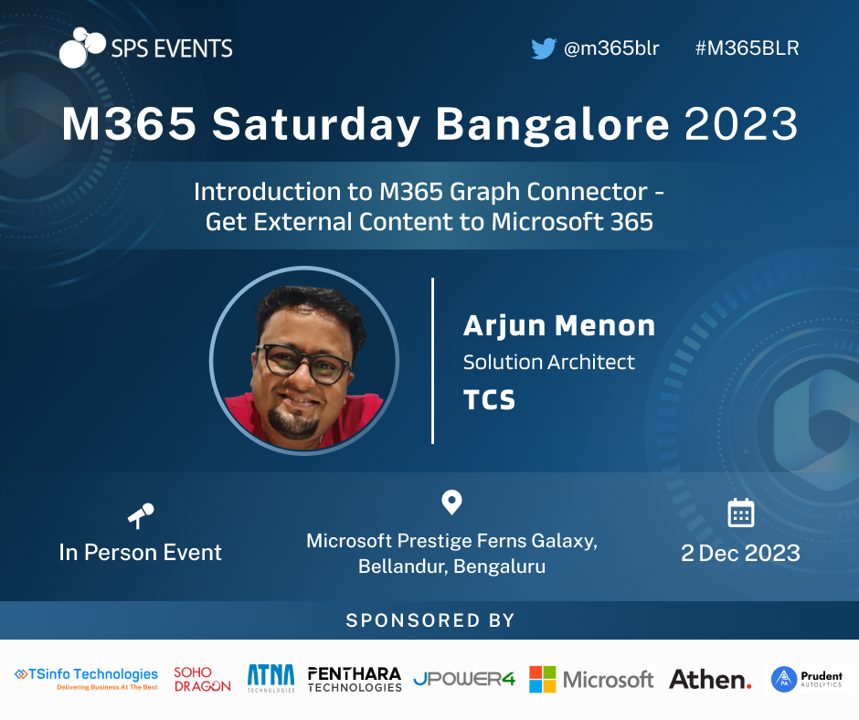

# M365 Saturday - Bangalore - 2023

This repository has the artifacts which is used by Arjun Menon in M365 Saturday Bangalore for the session **Turbo-boost your SPFx upgrades and deployment**

## Session Information

Session Link : [M365 Saturday Bangalore](https://www.m365event.com/)

Agenda Link : [Agenda](https://www.m365event.com/#agenda)

## Session Abstract

In this session, Arjun talks about Introduction to Graph Connector, how to build a Graph Connector and how to use it in Microsoft Search. He also talks about the new features in Graph Connector and how to use it in Microsoft Search.

## Session Slides

Slides are available in the [slides](slides/) folder.

## Demo Details

Source codes are demo are listed below

1. [Ingest data from API in a simple NodeJS JavaScript Project](/demo/1-ingest-publicapi/)
2. [Full blown production ready application for Creating and ingesting data from an external API into Microsoft Graph](/demo/2-enterprise-api/)

### Pre-requisites

Pre-requisites for the demo are given in the respective demo folders.